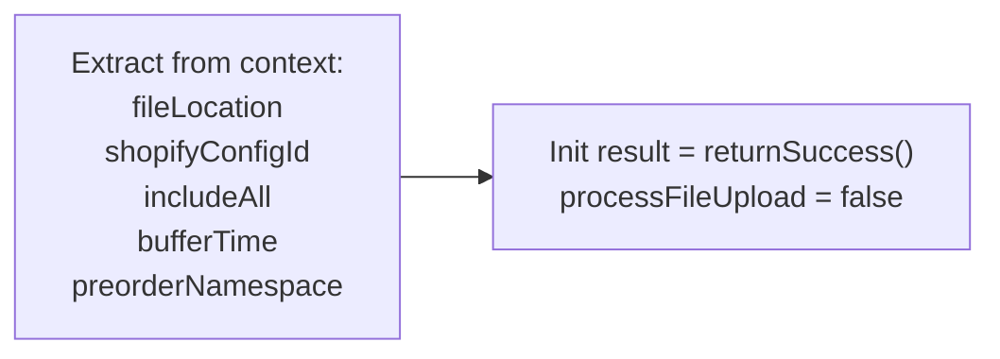
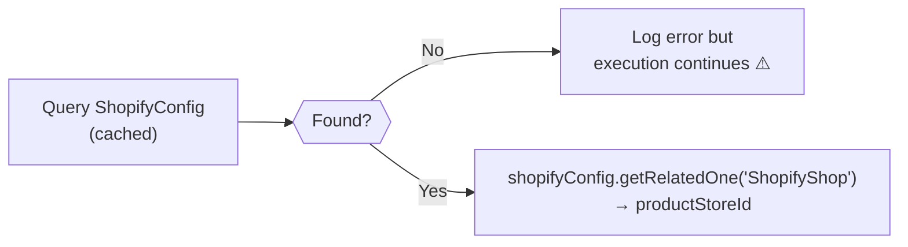
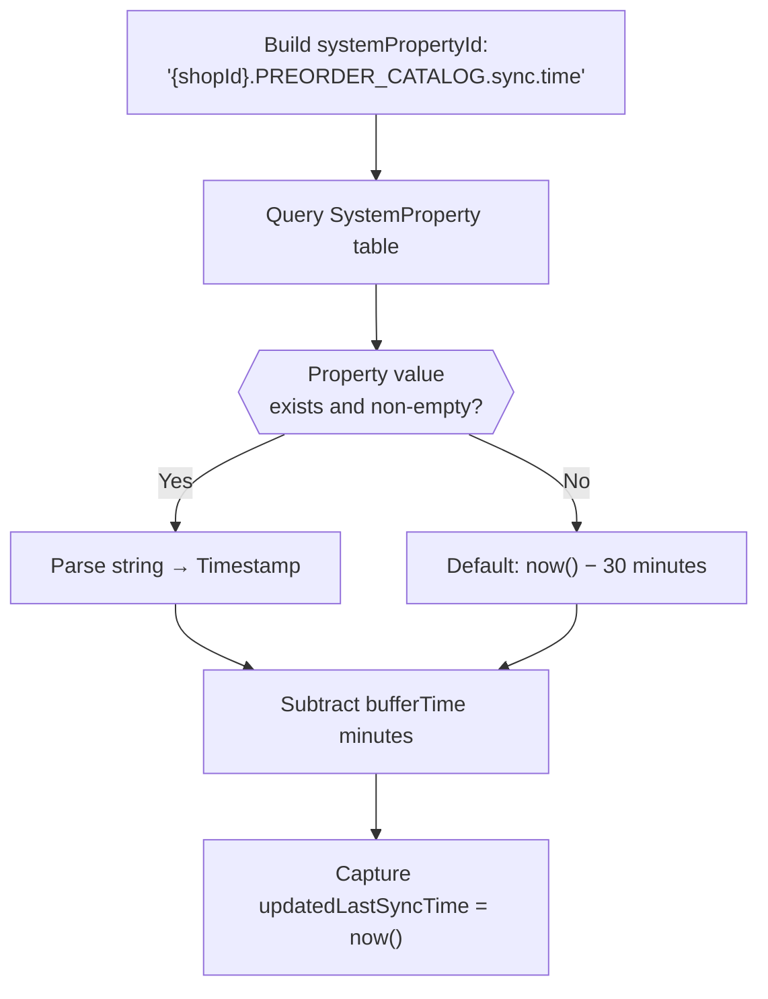
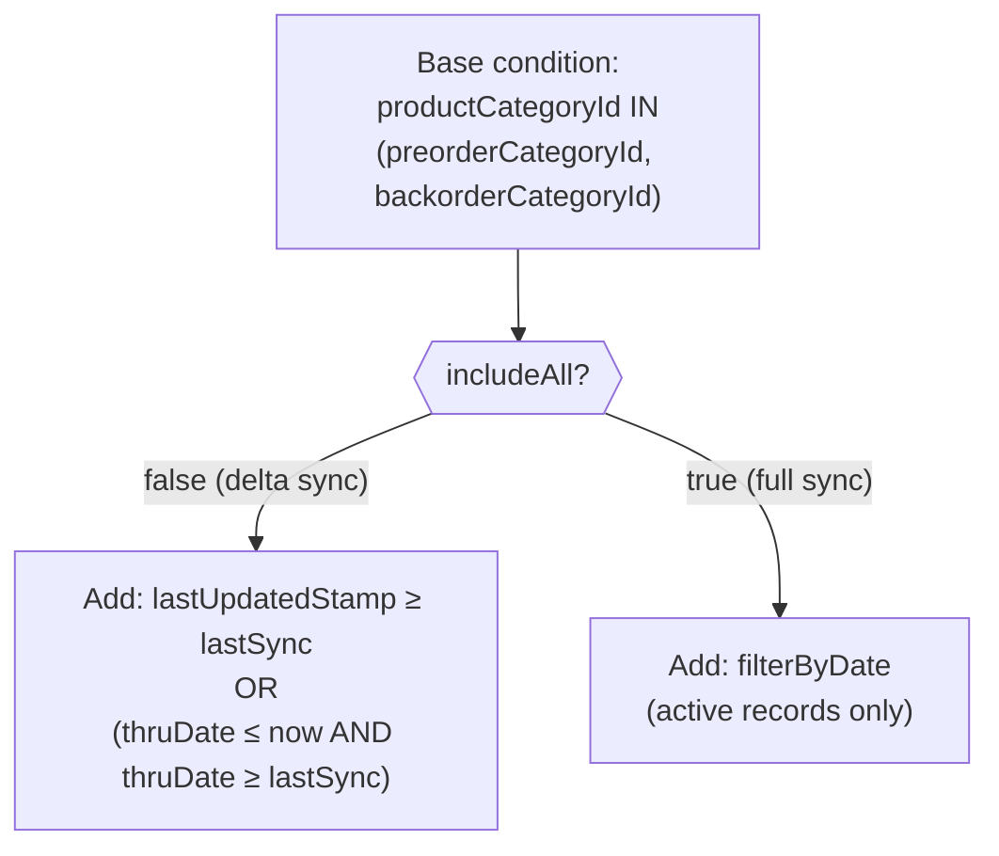
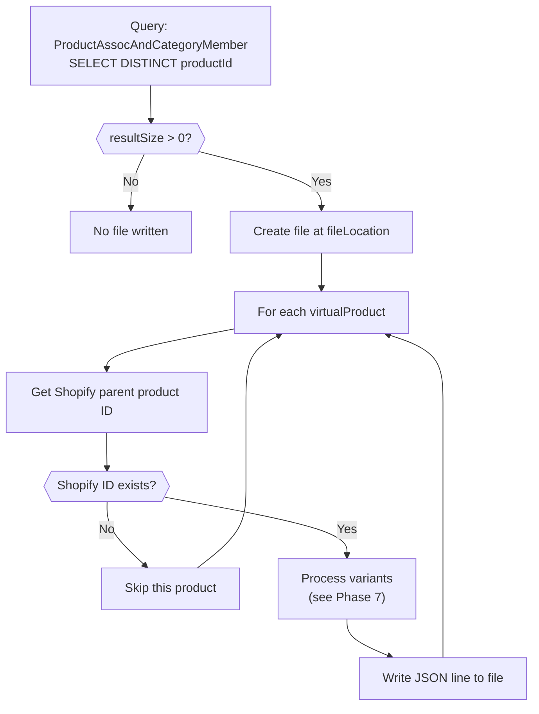
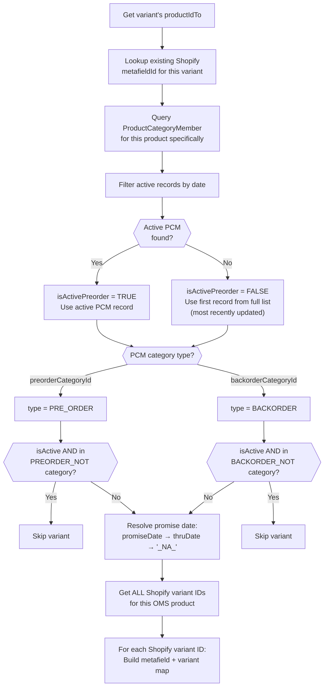
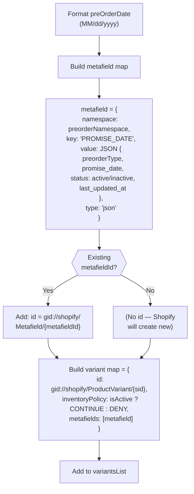
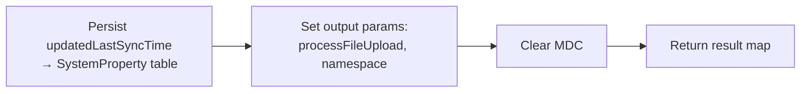

# 📊 Detailed Flowchart — `pushPreorderCatalogOnShopify`

> **Source**: [ProductServices.java (L59–L245)](file:///home/rachitaarsh/WorkSpace/Sand-box/ofbiz-oms/applications/shopify-connector/src/main/java/co/hotwax/shopify/graphQL/ProductServices.java#L59-L245)  
> **Service Definition**: [services_graphql.xml (L109–L123)](file:///home/rachitaarsh/WorkSpace/Sand-box/ofbiz-oms/applications/shopify-connector/servicedef/services_graphql.xml#L109-L123)

---

## 1. Service Contract

| Attribute | Type | Mode | Default | Description |
|---|---|---|---|---|
| `shopifyConfigId` | String | IN | — | Identifies the Shopify shop configuration |
| `preorderNamespace` | String | IN | `HC_PREORDER` | Metafield namespace for preorder data |
| `fileLocation` | String | IN | — | Absolute path for the output JSONL file |
| `includeAll` | Boolean | IN | `false` | `true` = full resync of active items; `false` = delta since last sync |
| `bufferTime` | Integer | IN | `1` | Minutes subtracted from last-sync time as safety overlap |
| `processFileUpload` | Boolean | OUT | `false` | Whether any data was written to the file |
| `namespace` | String | OUT | — | Echo of `preorderNamespace` for downstream consumers |

---

## 2. Master Flow Diagram

> The complete end-to-end execution flow is represented below using a structured textual flowchart. Each indentation level represents a deeper scope (loop / sub-block). Decision points are marked with **◆**, actions with **▸**, and error exits with **✖**.

---

### 🚀 ENTRY POINT

```
▸ [STEP 1] Set MDC discriminator = "shopify"
▸ [STEP 2] Extract context parameters:
            ├── fileLocation        (String)
            ├── shopifyConfigId     (String)
            ├── includeAll          (Boolean, default: false)
            ├── bufferTime          (Integer, default: 1 min)
            └── preorderNamespace   (String, default: "HC_PREORDER")
▸ [STEP 3] Initialize: result = ServiceUtil.returnSuccess(), processFileUpload = false
```

---

### 📦 PHASE A — Configuration & Shop Resolution `(L70–L79)`

```
▸ [STEP 4] Query ShopifyConfig by shopifyConfigId (cached)
│
◆ [DECISION] ShopifyConfig found?
│
├── ✖ NO  → Log error: "Shopify Config not found {shopifyConfigId}"
│           ⚠️ BUG: ServiceUtil.returnError() is called but NOT returned!
│           Code continues — will likely NPE at next line.
│
└── ✔ YES → Continue
        │
        ▸ [STEP 5] shopifyConfig.getRelatedOne("ShopifyShop", cached)
        ▸ [STEP 6] Extract: productStoreId = shopifyShop.getString("productStoreId")
```

---

### ⏱️ PHASE B — Last Sync Time Resolution `(L81–L94)`

```
▸ [STEP 7] Build systemPropertyId:
            "{shopId}.PREORDER_CATALOG.sync.time"
▸ [STEP 8] Query SystemProperty table:
            resource = "ShopifyServiceConfig", key = systemPropertyId
│
◆ [DECISION] Property value exists and is non-empty?
│
├── ✔ YES → Parse systemPropertyValue string → lastSyncDatetime (Timestamp)
│
└── ✖ NO  → Default: lastSyncDatetime = now() − 30 minutes
│
▸ [STEP 9]  Capture: updatedLastSyncTime = now()
▸ [STEP 10] Apply buffer: lastSyncDatetime = lastSyncDatetime − bufferTime minutes
            (creates overlap window to avoid missing boundary records)
```

---

### 📂 PHASE C — Catalog & Category Resolution `(L96–L103)`

```
▸ [STEP 11] Get first ProductStoreCatalog for productStoreId
            → Extract prodCatalogId
▸ [STEP 12] Resolve 4 category IDs from prodCatalogId:
            ┌─────────────────────────┬────────────────────────┬──────────────────────────────┐
            │ Variable                │ CatalogCategoryTypeId  │ Purpose                      │
            ├─────────────────────────┼────────────────────────┼──────────────────────────────┤
            │ preorderCategoryId      │ PCCT_PREORDR           │ Active preorder items        │
            │ backorderCategoryId     │ PCCT_BACKORDER         │ Active backorder items       │
            │ preorderNotCategoryId   │ PCCT_PREORDR_NOT       │ Exclusion list (preorder)    │
            │ backorderNotCategoryId  │ PCCT_BACKORDER_NOT     │ Exclusion list (backorder)   │
            └─────────────────────────┴────────────────────────┴──────────────────────────────┘
```

---

### 🔍 PHASE D — Query Condition Construction `(L105–L119)`

```
▸ [STEP 13] Base condition:
            productCategoryId IN (preorderCategoryId, backorderCategoryId)
│
◆ [DECISION] includeAll?
│
├── ✖ FALSE (Delta Sync)
│   └── Add OR condition:
│       (lastUpdatedStamp >= lastSyncDatetime)
│         OR
│       (thruDate <= now()  AND  thruDate >= lastSyncDatetime)
│
│       ℹ️ The thruDate clause catches POs that expired at midnight —
│          their lastUpdatedStamp didn't change, but thruDate falls
│          within the sync window.
│
└── ✔ TRUE (Full Sync)
    └── Add filterByDate condition:
        fromDate <= now() <= thruDate  (active records only)
```

---

### 🔄 PHASE E — Virtual Product Query & File Creation `(L121–L131)`

```
▸ [STEP 14] Query: ProductAssocAndCategoryMember
            SELECT DISTINCT productId  (using EntityListIterator)
│
◆ [DECISION] resultSize > 0?
│
├── ✖ NO  → Skip to PHASE I (no file written, processFileUpload stays false)
│
└── ✔ YES
    ▸ [STEP 15] Create file at fileLocation (if not exists)
    ▸ [STEP 16] Open FileWriter (append mode)
    └── Enter LOOP 1 ↓
```

---

### 🔄 LOOP 1 — Iterate Over Virtual Products `(L132–L224)`

> **Repeats** for each `virtualProduct` returned by the iterator.

```
▸ [STEP 17] virtualProduct = iterator.next()
│
▸ [STEP 18] shopifyParentProductId = ShopifyHelper.getShopifyProductId(
│               delegator, shopifyConfigId, virtualProduct.productId)
│
◆ [DECISION] shopifyParentProductId exists (non-empty)?
│
├── ✖ NO  → CONTINUE (skip to next virtual product)
│
└── ✔ YES
    ▸ [STEP 19] Initialize: variantsList = new ArrayList()
    │
    ▸ [STEP 20] Query: ProductAssocAndCategoryMember
    │           SELECT DISTINCT productIdTo
    │           WHERE conditions + productId = this virtualProduct's productId
    │           (using inner EntityListIterator)
    │
    ▸ [STEP 21] Initialize: DateFormat df = "MMM dd,yyyy HH:mm:ss"
    │           updatedDate = df.format(now())
    │
    └── Enter LOOP 2 ↓
```

---

### 🔁 LOOP 2 — Iterate Over Variant Products `(L145–L216)`

> **Repeats** for each `preorderItem` (variant) of the current virtual product.

```
▸ [STEP 22] preorderItem = innerIterator.next()
│           productId = preorderItem.getString("productIdTo")
│
▸ [STEP 23] Initialize: preorderType = null, isActivePreorder = true
│
▸ [STEP 24] metaFieldId = ShopifyHelper.getShopifyMetafieldId(
│               delegator, shopId, preorderNamespace, productId)
│
▸ [STEP 25] Query ProductCategoryMember for this specific productId:
│           WHERE productCategoryId IN (preorderCategoryId, backorderCategoryId)
│             AND productId = productId
│             AND (if includeAll: filterByDate active only)
│           ORDER BY lastUpdatedStamp DESC, thruDate NULLS LAST
│           → preOrderPCMList
│
▸ [STEP 26] Filter preOrderPCMList by date → get first active record
│
◆ [DECISION A] Active PCM record found?
│
├── ✔ YES → isActivePreorder = TRUE
│           preOrderPCM = active record
│
└── ✖ NO  → isActivePreorder = FALSE
│           preOrderPCM = first record from full list (most recent)
│           (This product was REMOVED from preorder catalog)
│
◆ [DECISION B] preOrderPCM is NOT null?
│
├── ✖ NO  → (No PCM at all — effectively skip, no variant map built)
│
└── ✔ YES
    │
    ◆ [DECISION C] What is preOrderPCM's productCategoryId?
    │
    ├── CASE: = preorderCategoryId
    │   │
    │   ▸ preorderType = "PRE_ORDER"
    │   │
    │   ◆ [DECISION D] isActivePreorder AND product is in PREORDER_NOT category?
    │   │
    │   ├── ✔ YES → CONTINUE (skip this variant — excluded by NOT category)
    │   └── ✖ NO  → Proceed to STEP 27 ↓
    │
    └── CASE: = backorderCategoryId
        │
        ▸ preorderType = "BACKORDER"
        │
        ◆ [DECISION E] isActivePreorder AND product is in BACKORDER_NOT category?
        │
        ├── ✔ YES → CONTINUE (skip this variant — excluded by NOT category)
        └── ✖ NO  → Proceed to STEP 27 ↓
```

```
▸ [STEP 27] Resolve preOrderDate:
│           IF promiseDate on PCM is not null → format as "MM/dd/yyyy"
│           ELSE IF thruDate on PCM is not null → format as "MM/dd/yyyy"
│           ELSE → preOrderDate = "_NA_"  (always-on preorder)
│
▸ [STEP 28] shopifyProductIds = ShopifyHelper.getAllShopifyProductIds(
│               delegator, shopifyConfigId, productId)
│
└── Enter LOOP 3 ↓
```

---

### 🏷️ LOOP 3 — Iterate Over Shopify Variant IDs `(L190–L215)`

> **Repeats** for each `shopifyProductId` mapped to this OMS variant product.

```
▸ [STEP 29] For each shopifyProductId in shopifyProductIds:
│
▸ [STEP 30] Resolve promiseDate format: "MM/dd/yyyy" (or "_NA_")
│
▸ [STEP 31] Build metafield map:
│           {
│             "namespace" : preorderNamespace,           // e.g. "HC_PREORDER"
│             "key"       : "PROMISE_DATE",
│             "value"     : toJSON({
│                             "preorderType"    : preorderType,      // "PRE_ORDER" or "BACKORDER"
│                             "promise_date"    : preOrderDate,      // "08/15/2026" or "_NA_"
│                             "status"          : isActive ? "active" : "inactive",
│                             "last_updated_at" : updatedDate        // "Jul 18,2026 20:25:14"
│                           }),
│             "type"      : "json"
│           }
│
◆ [DECISION F] Existing metaFieldId found (from STEP 24)?
│
├── ✔ YES → Add to metafield map:
│           "id" = "gid://shopify/Metafield/{metafieldId}"
│           (Shopify will UPDATE the existing metafield)
│
└── ✖ NO  → No "id" field added
│           (Shopify will CREATE a new metafield)
│
▸ [STEP 32] Set processFileUpload = TRUE  (data exists to upload)
│
▸ [STEP 33] Build variant map:
│           {
│             "id"              : "gid://shopify/ProductVariant/{shopifyProductId}",
│             "inventoryPolicy" : isActivePreorder ? "CONTINUE" : "DENY",
│             "metafields"      : [ metafield ]
│           }
│
│           ┌──────────────────────────────────────────────────────┐
│           │  CONTINUE = allow purchase even at 0 stock (preorder)│
│           │  DENY     = block purchase at 0 stock (removed)      │
│           └──────────────────────────────────────────────────────┘
│
▸ [STEP 34] Add variantMap to variantsList
│
└── (Back to LOOP 3 — next shopifyProductId)
```

---

### ✍️ LOOP 1 Continued — Write JSON Line `(L219–L223)`

```
▸ [STEP 35] After LOOP 2 exhausts all variants:
│
▸ [STEP 36] Write ONE JSON line to file:
│           {
│             "productId" : "gid://shopify/Product/{shopifyParentProductId}",
│             "variants"  : [ ...variantsList... ]
│           }
▸ [STEP 37] Append newline character '\n'
│
└── (Back to LOOP 1 — next virtualProduct)
```

---

### 💾 PHASE I — Persist Sync Time & Return `(L234–L244)`

```
▸ [STEP 38] Persist updatedLastSyncTime → SystemProperty table:
│           resource = "ShopifyServiceConfig"
│           key      = "{shopId}.PREORDER_CATALOG.sync.time"
│           value    = updatedLastSyncTime (as String)
│
▸ [STEP 39] Set output parameters:
│           result.put("processFileUpload", processFileUpload)
│           result.put("namespace", preorderNamespace)
│
▸ [STEP 40] Debug.clearMDC()
│
└── ✅ RETURN result
```

---

### ✖ ERROR HANDLING PATHS

```
┌─────────────────────────────────────────────────────────────────────────────┐
│  SCOPE                              │ EXCEPTION TYPES        │ BEHAVIOR    │
├─────────────────────────────────────┼────────────────────────┼─────────────┤
│  Inner file-write block (L130–L228) │ GenericEntityException │ Log error   │
│                                     │ IOException            │ → returnErr │
├─────────────────────────────────────┼────────────────────────┼─────────────┤
│  Outer iterator block (L121–L233)   │ GeneralException       │ Log error   │
│                                     │ IOException            │ → returnErr │
├─────────────────────────────────────┼────────────────────────┼─────────────┤
│  Outermost try-catch (L70–L240)     │ GeneralException       │ Log error   │
│                                     │                        │ → returnErr │
└─────────────────────────────────────┴────────────────────────┴─────────────┘

⚠️ No retry or partial-success mechanism — any error aborts the entire service.
```

---

## 3. Phase-by-Phase Detailed Narrative

### Phase 1 — Initialization (L59–L68)



- Sets MDC discriminator to `"shopify"` for log routing
- All input parameters are extracted from the service context
- `preorderNamespace` defaults to `HC_PREORDER` if not supplied

### Phase 2 — Configuration & Shop Resolution (L70–L79)



> [!WARNING]
> At line 76, the code calls `ServiceUtil.returnError(...)` but does **not** use `return`. This means execution continues even when the `ShopifyConfig` is not found, which could cause a `NullPointerException` downstream at `shopifyConfig.getRelatedOne(...)`.

### Phase 3 — Last Sync Time Resolution (L81–L94)



The **buffer time** creates an overlap window so that records modified right at the sync boundary are not missed on the next run.

### Phase 4 — Catalog Category Resolution (L96–L103)

Four category IDs are resolved from the product store's catalog:

| Variable | Catalog Category Type | Purpose |
|---|---|---|
| `preorderCategoryId` | `PCCT_PREORDR` | Active preorder items |
| `backorderCategoryId` | `PCCT_BACKORDER` | Active backorder items |
| `preorderNotCategoryId` | `PCCT_PREORDR_NOT` | Exclusion list for preorders |
| `backorderNotCategoryId` | `PCCT_BACKORDER_NOT` | Exclusion list for backorders |

### Phase 5 — Query Condition Construction (L105–L119)



The delta-mode OR clause handles **two scenarios**:
1. Records recently updated (standard change detection)
2. Records whose PO expired at midnight — `thruDate` was pre-set, so `lastUpdatedStamp` won't change, but `thruDate` falls within the sync window

### Phase 6 — Virtual Product Iteration (L121–L228)



The view entity `ProductAssocAndCategoryMember` joins `ProductAssoc` with `ProductCategoryMember`, returning **virtual** product IDs whose **variant** products are in the preorder/backorder categories.

### Phase 7 — Variant Processing (L140–L216) — The Core Logic

For each variant of a virtual product:



### Phase 8 — Metafield & Variant Map Construction (L190–L214)

For **each Shopify variant ID** of a product:



> [!IMPORTANT]
> **`inventoryPolicy`** is set to:
> - **`CONTINUE`** → if the product is actively in preorder/backorder (customers can buy even at 0 stock)
> - **`DENY`** → if the product has been removed from preorder catalog (no purchase when out of stock)

### Phase 9 — JSONL File Output (L219–L223)

Each virtual product produces **one JSON line** in the output file:

```json
{
  "productId": "gid://shopify/Product/123456789",
  "variants": [
    {
      "id": "gid://shopify/ProductVariant/987654321",
      "inventoryPolicy": "CONTINUE",
      "metafields": [
        {
          "namespace": "HC_PREORDER",
          "key": "PROMISE_DATE",
          "value": "{\"preorderType\":\"PRE_ORDER\",\"promise_date\":\"08/15/2026\",\"status\":\"active\",\"last_updated_at\":\"Jul 18,2026 20:25:14\"}",
          "type": "json",
          "id": "gid://shopify/Metafield/111222333"
        }
      ]
    }
  ]
}
```

### Phase 10 — Sync Time Persistence & Return (L234–L244)



---

## 4. Data Model & Entity Relationships

> All field names and keys below are sourced from the actual entity XML definitions in the codebase:
> - [entitymodel.xml](file:///home/rachitaarsh/WorkSpace/Sand-box/ofbiz-oms/applications/shopify-connector/entitydef/entitymodel.xml) (Shopify entities)
> - [entitymodel_view.xml](file:///home/rachitaarsh/WorkSpace/Sand-box/ofbiz-oms/applications/shopify-connector/entitydef/entitymodel_view.xml) (Shopify view entities)
> - [entitymodel_view.xml](file:///home/rachitaarsh/WorkSpace/Sand-box/ofbiz-oms/applications/hwmapps/entitydef/entitymodel_view.xml#L7709-L7724) (ProductAssocAndCategoryMember view entity)

---

### 4.1 Shopify Connector Entities

#### `ShopifyConfig` — PK: `shopifyConfigId`
```
┌──────────────────────────────────────────────────────────────────┐
│  ShopifyConfig                                                    │
├──────────────────────┬───────────────┬───────────────────────────┤
│  Field               │ Type          │ Notes                     │
├──────────────────────┼───────────────┼───────────────────────────┤
│  shopifyConfigId  🔑 │ id            │ PRIMARY KEY               │
│  shopifyConfigName   │ name          │                           │
│  accessScopeEnumId   │ id-ne         │ FK → Enumeration          │
│  apiVersion          │ very-short    │                           │
│  productStoreId      │ id            │ FK → ProductStore         │
│  shopId              │ id            │ FK → ShopifyShop          │
│  webSiteId           │ id            │ FK → WebSite              │
│  apiUrl              │ value         │ encrypted                 │
│  accessToken         │ long-varchar  │ encrypted                 │
│  sharedSecret        │ long-varchar  │ encrypted (webhook HMAC)  │
└──────────────────────┴───────────────┴───────────────────────────┘
  🔗 Relations:
     → ShopifyShop  (one)   via shopId
     → ProductStore (one)   via productStoreId
```

#### `ShopifyShop` — PK: `shopId`
```
┌──────────────────────────────────────────────────────────────────┐
│  ShopifyShop                                                      │
├──────────────────────┬───────────────┬───────────────────────────┤
│  Field               │ Type          │ Notes                     │
├──────────────────────┼───────────────┼───────────────────────────┤
│  shopId           🔑 │ id            │ PRIMARY KEY               │
│  shopifyShopId       │ id-long       │ Shopify's numeric shop ID │
│  productStoreId      │ id            │ FK → ProductStore         │
│  name                │ name          │ Shop display name         │
│  myshopifyDomain     │ id-vlong      │ e.g. store.myshopify.com  │
│  primaryLocationId   │ id-long       │ Default Shopify location  │
│  currency            │ id            │ Shop currency code        │
│  isEnabled           │ indicator     │ Y/N active flag           │
└──────────────────────┴───────────────┴───────────────────────────┘
  🔗 Relations:
     → ProductStore (one)  via productStoreId
     ← ShopifyConfig (many) via shopId
     ← ShopifyShopProduct (many) via shopId
```

#### `ShopifyShopProduct` — PK: `(shopId, shopifyProductId)`
```
┌──────────────────────────────────────────────────────────────────┐
│  ShopifyShopProduct                                               │
├─────────────────────────┬───────────┬───────────────────────────┤
│  Field                  │ Type      │ Notes                     │
├─────────────────────────┼───────────┼───────────────────────────┤
│  shopId              🔑 │ id        │ PK + FK → ShopifyShop     │
│  shopifyProductId    🔑 │ id-long   │ PK (Shopify variant GID)  │
│  productId              │ id        │ FK → Product (OMS SKU)    │
│  shopifyInventoryItemId │ id-long   │ Shopify inventory item    │
├─────────────────────────┴───────────┴───────────────────────────┤
│  INDEX: IDX_SHOP_INV_ID on (shopId, shopifyInventoryItemId)     │
└─────────────────────────────────────────────────────────────────┘
  🔗 Relations:
     → ShopifyShop (one)  via shopId
     → Product    (one)   via productId
```

#### `ShopifyMetafield` — PK: `metafieldId`
```
┌──────────────────────────────────────────────────────────────────┐
│  ShopifyMetafield                                                 │
├──────────────────────┬───────────────┬───────────────────────────┤
│  Field               │ Type          │ Notes                     │
├──────────────────────┼───────────────┼───────────────────────────┤
│  metafieldId      🔑 │ id            │ PRIMARY KEY               │
│  namespace           │ id            │ e.g. "HC_PREORDER"        │
│  metaKey             │ short-varchar │ e.g. "PROMISE_DATE"       │
│  metavalue           │ very-long     │ JSON string value         │
│  metatype            │ short-varchar │ e.g. "json"               │
│  ownerResource       │ short-varchar │ Owner type                │
└──────────────────────┴───────────────┴───────────────────────────┘
```

#### `ShopifyShopProductMetafield` — PK: `(shopifyProductId, metafieldId)`
```
┌──────────────────────────────────────────────────────────────────┐
│  ShopifyShopProductMetafield  (Junction table)                    │
├──────────────────────┬───────────────┬───────────────────────────┤
│  Field               │ Type          │ Notes                     │
├──────────────────────┼───────────────┼───────────────────────────┤
│  shopifyProductId 🔑 │ id-long       │ PK + FK → ShopifyShopProd │
│  metafieldId      🔑 │ id            │ PK + FK → ShopifyMetafield│
└──────────────────────┴───────────────┴───────────────────────────┘
  🔗 Relations:
     → ShopifyMetafield   (one)  via metafieldId
     → ShopifyShopProduct (many) via shopifyProductId
```

---

### 4.2 OFBiz Core Entities (Used by the Service)

#### `ProductStore` → `ProductStoreCatalog` → `ProdCatalog`
```
ProductStore                    ProductStoreCatalog              ProdCatalog
┌─────────────────────┐        ┌─────────────────────────┐     ┌──────────────────┐
│ productStoreId  🔑  │───1:N──│ productStoreId  🔑      │     │ prodCatalogId 🔑 │
│ storeName           │        │ prodCatalogId   🔑      │──N:1│ catalogName      │
│ ...                 │        │ fromDate        🔑      │     │ ...              │
└─────────────────────┘        │ thruDate                │     └──────────────────┘
                               │ sequenceNum             │
                               └─────────────────────────┘
```

#### `ProdCatalogCategory` → `ProductCategory`
```
ProdCatalogCategory                              ProductCategory
┌──────────────────────────────────────┐        ┌───────────────────────────┐
│ prodCatalogId            🔑         │        │ productCategoryId  🔑    │
│ productCategoryId        🔑         │──N:1──│ categoryName              │
│ prodCatalogCategoryTypeId🔑         │        │ description               │
│ fromDate                 🔑         │        │ ...                       │
│ thruDate                            │        └───────────────────────────┘
│ sequenceNum                         │
└──────────────────────────────────────┘
   Used types in this service:
     PCCT_PREORDR       → preorderCategoryId
     PCCT_BACKORDER     → backorderCategoryId
     PCCT_PREORDR_NOT   → preorderNotCategoryId
     PCCT_BACKORDER_NOT → backorderNotCategoryId
```

#### `Product` → `ProductAssoc` (Virtual ↔ Variant)
```
Product (Virtual)                  ProductAssoc                    Product (Variant)
┌──────────────────────┐          ┌──────────────────────────┐   ┌──────────────────────┐
│ productId        🔑  │────1:N──│ productId         🔑     │   │ productId        🔑  │
│ productTypeId        │          │ productIdTo       🔑     │──N:1 │ internalName (SKU)│
│ internalName         │          │ productAssocTypeId🔑     │   │ productTypeId        │
│ productName          │          │ fromDate          🔑     │   │ ...                  │
│ isVirtual            │          │ thruDate                 │   └──────────────────────┘
└──────────────────────┘          │ (type = PRODUCT_VARIANT) │
                                  └──────────────────────────┘
```

#### `ProductCategoryMember` — The Central Preorder Data
```
┌──────────────────────────────────────────────────────────────────┐
│  ProductCategoryMember                                            │
├──────────────────────┬───────────────┬───────────────────────────┤
│  Field               │ Type          │ Notes                     │
├──────────────────────┼───────────────┼───────────────────────────┤
│  productCategoryId🔑 │ id            │ PK + FK → ProductCategory │
│  productId        🔑 │ id            │ PK + FK → Product         │
│  fromDate         🔑 │ date-time     │ PK                        │
│  thruDate            │ date-time     │ When preorder expires     │
│  promiseDate         │ date-time     │ Estimated delivery date   │
│  comments            │ comment       │                           │
│  lastUpdatedStamp    │ date-time     │ Auto-maintained by OFBiz  │
└──────────────────────┴───────────────┴───────────────────────────┘
  Key fields for this service:
     productCategoryId → determines PRE_ORDER vs BACKORDER type
     thruDate          → used for expiry detection + promise date fallback
     promiseDate       → primary promise date sent to Shopify
     lastUpdatedStamp  → used for delta sync detection
```

#### `SystemProperty` — Sync State Store
```
┌──────────────────────────────────────────────────────────────────┐
│  SystemProperty                                                   │
├──────────────────────┬───────────────┬───────────────────────────┤
│  Field               │ Type          │ Notes                     │
├──────────────────────┼───────────────┼───────────────────────────┤
│  systemResourceId 🔑 │ id            │ "ShopifyServiceConfig"    │
│  systemPropertyId 🔑 │ id            │ "{shopId}.PREORDER_CATALOG│
│                      │               │  .sync.time"              │
│  systemPropertyValue │ value         │ Last sync timestamp       │
└──────────────────────┴───────────────┴───────────────────────────┘
```

---

### 4.3 View Entity: `ProductAssocAndCategoryMember`

> **Definition**: [entitymodel_view.xml:L7709–L7724](file:///home/rachitaarsh/WorkSpace/Sand-box/ofbiz-oms/applications/hwmapps/entitydef/entitymodel_view.xml#L7709-L7724)

This is the **primary query entity** used by the service. It joins `ProductAssoc` (virtual→variant relationship) with `ProductCategoryMember` (category assignment) on the **variant product ID**.

```
┌─────────────────────────────────────────────────────────────────────────┐
│  VIEW: ProductAssocAndCategoryMember                                     │
│                                                                          │
│  ┌──────────────┐    JOIN ON                  ┌──────────────────────┐  │
│  │ ProductAssoc  │    PA.productIdTo =         │ ProductCategoryMember│  │
│  │ (alias: PA)   │────PCM.productId ──────────│ (alias: PCM)         │  │
│  └──────────────┘                              └──────────────────────┘  │
│                                                                          │
│  Exposed Fields:                                                         │
│  ┌───────────────────┬─────────┬───────────────────────────────────────┐ │
│  │ Alias             │ Source  │ Description                           │ │
│  ├───────────────────┼─────────┼───────────────────────────────────────┤ │
│  │ productId         │ PA      │ Virtual (parent) product ID           │ │
│  │ productIdTo       │ PA      │ Variant (child) product ID            │ │
│  │ productCategoryId │ PCM     │ Preorder/Backorder category           │ │
│  │ fromDate          │ PCM     │ Category membership start             │ │
│  │ thruDate          │ PCM     │ Category membership end (expiry)      │ │
│  │ promiseDate       │ PCM     │ Estimated delivery/promise date       │ │
│  │ lastUpdatedStamp  │ PCM     │ Last modification timestamp           │ │
│  └───────────────────┴─────────┴───────────────────────────────────────┘ │
└─────────────────────────────────────────────────────────────────────────┘
```

---

### 4.4 Complete Entity Relationship Map

```
                          ┌─────────────────┐
                          │  ProductStore    │
                          │  (productStoreId)│
                          └────────┬────────┘
                                   │ 1:N
                          ┌────────▼────────┐
                          │ProductStoreCatalog│
                          │(prodCatalogId)   │
                          └────────┬────────┘
                                   │ N:1
                          ┌────────▼────────┐
                          │  ProdCatalog     │
                          │  (prodCatalogId) │
                          └────────┬────────┘
                                   │ 1:N
                        ┌──────────▼──────────┐
                        │ ProdCatalogCategory  │
                        │(prodCatalogCategory  │
                        │    TypeId)           │
                        └──────────┬──────────┘
                                   │ N:1
                        ┌──────────▼──────────┐
                        │  ProductCategory     │◄──────────────────────────────┐
                        │  (productCategoryId) │                               │
                        └──────────┬──────────┘                               │
                                   │ 1:N                                      │
                        ┌──────────▼──────────┐                               │
                        │ProductCategoryMember │                               │
                        │(productCategoryId,   │                               │
                        │ productId, fromDate) │                               │
                        │ + thruDate           │                               │
                        │ + promiseDate        │                               │
                        └──────────┬──────────┘                               │
                                   │ N:1                                      │
┌───────────────┐     ┌────────────▼────────────┐     ┌───────────────┐       │
│Product(Virtual)│──1:N│     ProductAssoc         │N:1──│Product(Variant)│       │
│  (productId)   │     │(productId, productIdTo, │     │  (productId)   │───────┘
└───────┬───────┘     │ productAssocTypeId,      │     └───────┬───────┘
        │              │ fromDate)                │             │
        │              └─────────────────────────┘             │
        │                                                       │
        │         ┌────────────────────────────┐               │
        │         │    ShopifyShopProduct       │               │
        │         │   (shopId, shopifyProductId)│               │
        │         │    + productId ─────────────┼───────────────┘
        │         └──────────┬─────────────────┘
        │                    │ N:1
        │         ┌──────────▼─────────────────┐
        │         │      ShopifyShop            │
        │         │      (shopId)               │
        │         └──────────┬─────────────────┘
        │                    │ 1:1
        │         ┌──────────▼─────────────────┐
        └────────►│    ShopifyConfig            │
                  │    (shopifyConfigId)        │
                  │    + shopId (FK→ShopifyShop)│
                  │    + productStoreId         │
                  └────────────────────────────┘

                  ┌────────────────────────────┐
                  │   ShopifyMetafield          │
                  │   (metafieldId)             │
                  │   + namespace               │
                  │   + metaKey                 │
                  └──────────┬─────────────────┘
                             │ 1:N
                  ┌──────────▼─────────────────┐
                  │ShopifyShopProductMetafield  │
                  │(shopifyProductId,metafieldId)│──► links to ShopifyShopProduct
                  └────────────────────────────┘

                  ┌────────────────────────────┐
                  │    SystemProperty           │
                  │(systemResourceId,           │
                  │ systemPropertyId)           │   ← Stores last sync timestamp
                  │ + systemPropertyValue       │
                  └────────────────────────────┘
```

---

### 4.5 Entity Data Flow in the Service

> How each entity is **read (R)** or **written (W)** during execution:

| # | Entity | Operation | Step | What is accessed / written |
|---|---|---|---|---|
| 1 | `ShopifyConfig` | **R** (cached) | STEP 4 | Look up config by `shopifyConfigId` |
| 2 | `ShopifyShop` | **R** (cached) | STEP 5 | Get `productStoreId`, `shopId` via `getRelatedOne` |
| 3 | `SystemProperty` | **R** | STEP 8 | Read last sync time: key=`{shopId}.PREORDER_CATALOG.sync.time` |
| 4 | `ProductStoreCatalog` | **R** | STEP 11 | Get first catalog for `productStoreId` → `prodCatalogId` |
| 5 | `ProdCatalogCategory` | **R** | STEP 12 | Resolve 4 category IDs via `CatalogDataSetupUtility` |
| 6 | `ProductAssocAndCategoryMember` | **R** (iterator) | STEP 14 | **Outer query**: `SELECT DISTINCT productId` (virtual products) |
| 7 | `ShopifyShopProduct` | **R** | STEP 18 | `ShopifyHelper.getShopifyProductId()` — find parent Shopify GID |
| 8 | `ProductAssocAndCategoryMember` | **R** (iterator) | STEP 20 | **Inner query**: `SELECT DISTINCT productIdTo` for one virtual product |
| 9 | `ShopifyShopProductMetafield` + `ShopifyMetafield` | **R** | STEP 24 | `ShopifyHelper.getShopifyMetafieldId()` — existing metafield lookup |
| 10 | `ProductCategoryMember` | **R** | STEP 25 | Query PCM for specific variant + preorder/backorder categories |
| 11 | `ProductCategoryMember` | **R** | STEP 26 | Filter by date → determine active vs. inactive preorder status |
| 12 | `ProductCategory` | **R** | DECISION D/E | `CategoryWorker.isProductInCategory()` — NOT-category exclusion check |
| 13 | `ShopifyShopProduct` | **R** | STEP 28 | `ShopifyHelper.getAllShopifyProductIds()` — all Shopify variant IDs |
| 14 | `SystemProperty` | **W** | STEP 38 | Persist `updatedLastSyncTime` for next run |

> [!TIP]
> The service is **read-heavy** — it only writes to `SystemProperty` (one row). All product/metafield data is written to a **JSONL file** which is then consumed by a separate bulk upload service (`uploadJsonlFileToShopify`).

---

## 5. Helper Methods Reference

| Method | Location | Purpose |
|---|---|---|
| `ShopifyHelper.getShopifyProductId()` | [ShopifyHelper.java:L430](file:///home/rachitaarsh/WorkSpace/Sand-box/ofbiz-oms/applications/shopify-connector/src/main/java/co/hotwax/shopify/ShopifyHelper.java#L430) | Gets the Shopify parent product GID for a virtual product |
| `ShopifyHelper.getShopifyMetafieldId()` | [ShopifyHelper.java:L502](file:///home/rachitaarsh/WorkSpace/Sand-box/ofbiz-oms/applications/shopify-connector/src/main/java/co/hotwax/shopify/ShopifyHelper.java#L502) | Gets existing metafield ID for update vs. create |
| `ShopifyHelper.getAllShopifyProductIds()` | [ShopifyHelper.java:L441](file:///home/rachitaarsh/WorkSpace/Sand-box/ofbiz-oms/applications/shopify-connector/src/main/java/co/hotwax/shopify/ShopifyHelper.java#L441) | Gets all Shopify variant IDs mapped to an OMS product |
| `CatalogDataSetupUtility.getProductCategoryId()` | — | Resolves category ID from catalog + type |
| `CategoryWorker.isProductInCategory()` | OFBiz core | Checks active category membership |
| `WebPageOptimizationHelper.toJSON()` | — | Serializes map to JSON string |

---

## 6. Error Handling Summary

| Scope | Exception Types | Behavior |
|---|---|---|
| Outer try-catch (L70–L240) | `GeneralException` | Log error + `returnError()` |
| Virtual product iterator (L121–L233) | `GeneralException`, `IOException` | Log error + `returnError()` |
| File write block (L130–L228) | `GenericEntityException`, `IOException` | Log error + `returnError()` |

> [!NOTE]
> All error paths log via `Debug.logError()` and return `ServiceUtil.returnError(e.getMessage())`. There is no retry or partial-success mechanism — any error aborts the entire service.

---

## 7. Key Business Rules

1. **Delta vs. Full Sync**: `includeAll=false` fetches only changes since last sync; `includeAll=true` fetches all currently active preorder/backorder members
2. **Always-On Preorder**: When no `promiseDate` or `thruDate` exists, `preOrderDate` is set to `"_NA_"`, signaling an indefinite preorder
3. **NOT Categories**: Products in `PCCT_PREORDR_NOT` or `PCCT_BACKORDER_NOT` are **excluded** from the feed, but only when they are **active** preorders — inactive preorders still get the `DENY` policy sent
4. **Expired PO Handling**: The delta condition includes items where `thruDate` falls within the sync window, catching POs that expire at midnight even if `lastUpdatedStamp` didn't change
5. **Inventory Policy**: Active preorder → `CONTINUE` (allow overselling); Inactive → `DENY` (stop selling at 0 stock)

